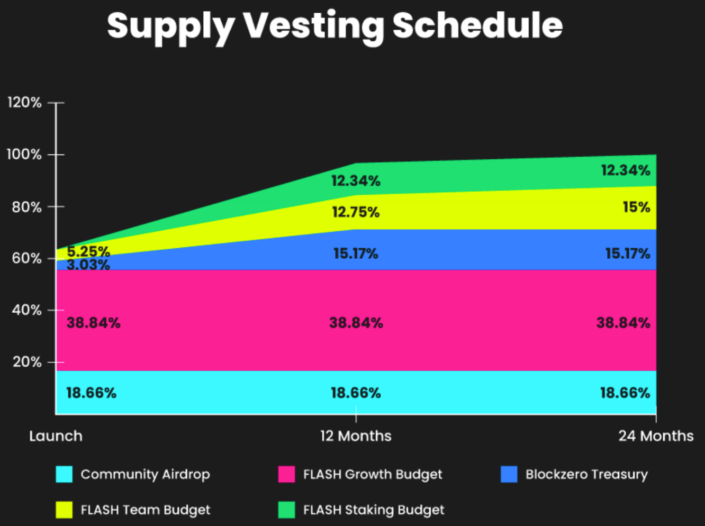

Flashstake Token
===============

.. |location_link_token_a1| raw:: html

   <a href="https://blockzerolabs.io" target="_blank">Blockzero Labs</a>

.. |location_link_token_a2| raw:: html

   <a href="https://app.safe.global/eth:0x5089722613C2cCEe071C39C59e9889641f435F15/balances" target="_blank">Blockzero Labs Treasury</a>

.. |location_link_token_a3| raw:: html

   <a href="https://etherscan.io/token/0xB1f1F47061A7Be15C69f378CB3f69423bD58F2F8#balances" target="_blank">0xB1f1F47061A7Be15C69f378CB3f69423bD58F2F8</a>

.. |location_link_token_a4| raw:: html

   <a href="https://optimistic.etherscan.io/token/0x86bEA60374f220dE9769b2fEf2db725bc1cDd335#balances" target="_blank">0x86bEA60374f220dE9769b2fEf2db725bc1cDd335</a>

+------------+---------------------------------------------+
| Network    | Contract Address                            |
+============+=============================================+
| Ethereum   | |location_link_token_a3|                    |
+------------+---------------------------------------------+
| Optimism   | |location_link_token_a4|                    |
+------------+---------------------------------------------+

Similar to how Uniswap v3 has a fee switch, Flashstake has a time switch. Each time someone uses the Flashstake
protocol, a 0-20% time fee is taken and sent to the Time Vault (:doc:`FTokenAccumulator </core-concepts/ftoken-accumulator>`).

.. note::
    For example, Bob stakes 100 ETH which generates 10 ETH upfront yield. Currently, 95% of this yield goes to
    Bob and 5% goes to the Time Vault.

The only way to remove fees from the Time Vault is by depositing FLASH tokens. In short, this makes $FLASH
the exclusive token for consolidating, arbitraging, and unlocking time fees from the protocol. Read more about this
process on the :doc:`FTokenAccumulator </core-concepts/ftoken-accumulator>` section of the documentation.

.. important::
    $FLASH tokens captured in this process will be redistributed to $FLASH token holders. This process has not
    been finalised.

Token Distribution
-------------------
Flashstake was built upon the legacy of previous versions, facilitated by |location_link_token_a1| and its
community. As a result, a portion of the tokens, roughly one-third, was allocated back to the Blockzero
ecosystem that made the development of Flashstake possible, with the remaining two-thirds set
aside for various project activities.

There is a fixed total supply of 150 million FLASH tokens with no further minting possible.

A budget was approved for various purposes after the launch, which included an airdrop for holders of
XIO (Blockzero) and FLASH V1 & V2, compensation for the |location_link_token_a2|, incentives for Flashstake Core
contributors, a budget for general growth of Flashstake, and funds set aside for the Flashback
incentive program.

Vesting Schedule
-------------------
At the time of launch, the circulating supply of FLASH will include the community airdrop of 28 million
FLASH and some tokens from the Flashstake treasury that may be utilized for pre-launch marketing initiatives.
The vesting schedules for the budget allocations have been set, with the unlock schedules of tokens shown
in the chart below.

.. note::
    Launch: August 1st, 2022

    12 months: August 1st, 2023

    24 months: August 1st, 2024

It is important to note that the vesting of tokens does not automatically make them a part of the
circulating supply. The initial team allocation have a one-month vesting period after
the launch of the protocol (7.9 million FLASH). The rest of the team allocation will only
vest if they continue to contribute to Flashstake over the course of two years.

The vesting schedules are in place to ensure the proper distribution of tokens and to provide a sense of
stability for the community. With these schedules in place, the Flashstake ecosystem will be able to
grow and develop in a healthy and sustainable manner.
