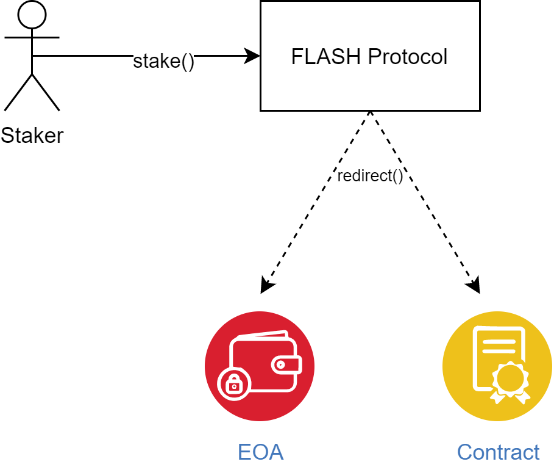
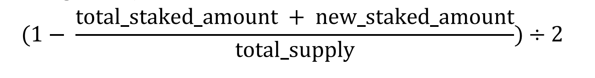
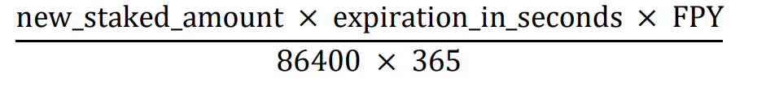

Protocol Overview
=================

Existing DeFi projects aim to provide annualized earnings for specific currencies using smart contracts.
Usually once the user funds are successfully allocated in the smart contract, earnings are calculated every Ethereum block (i.e. every ~15 seconds). 

So, if the **APY** (Annualized Percentage Yield) is **10%** and a user stakes **$100**, after 1 year (if the APY was stable), he will be able to withdraw **$110**.

**Flash** is a permissionless protocol allowing everyone to stake **$FLASH** and earn instant upfront yield. 

Flash protocol enables users to stake tokens and earn the yield immediately.
Using the same example as above, if the user stakes **$100** for 1 year, he will get **$10** instantly and have his **$100** locked for 1 year.

Because of its permissionless nature, it will exist for as long as Ethereum does. 

The Flash Protocol is fueled by the **$FLASH** Token the same way Ethereum is fueled by **ETH**. To learn more about it read :doc:`../core-concepts/flash-token`

Features
--------

The Flash Protocol is built with numerous useful features:

- permissionless

- open source

- stake **$FLASH** and redirect the yield to EOA or a contract

- unstake **$FLASH** after the expire period is over

- unstake **$FLASH** before the expire period is over, but burn percentage of the staked amount based on the remaining time

- dynamic FPY (Flash Percentage Yield) calculated with the formula:

- dynamic instant yield calculated with the formula:

Glossary
--------

Automated market maker
~~~~~~~~~~~~~~~~~~~~~~~~
An automated market maker is a smart contract on Ethereum that hold on-chain liquidity reserves. Users can trade against these reserves at prices set by an automated market making formula.

FPY
~~~
Flash Percentage Yield - the percentage used to calculate the yield reward.

ERC20
~~~~~
ERC20 tokens are fungibile tokens on Ethereum. Uniswap supports all standard ERC20 implementations.

Pool
~~~~
Liquidity within a pair is pooled across all liquidity providers.

Liquidity provider / LP
~~~~~~~~~~~~~~~~~~~~~~~~~
A liquidity provider is someone who deposits an equivalent value of ERC20 tokens into the liquidity pool within a pair. Liquidity providers take on price risk and are compensated with fees.

Slippage
~~~~~~~~
The amount the price moves in a trading pair between when a transaction is submitted and when it is executed.
