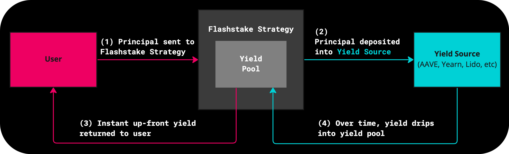

Protocol Overview
===================

The Flashstake protocol is a novel financial infrastructure which allows users to receive yield on deposited assets
instantly with a fixed rate over a set duration. The protocol utilises Flash Strategies which utilise underlying
protocols such as AAVE, Yearn, etc to generate yield. The sequence diagram below gives a high level overview of
how this process works with the core concepts explained below.

Upon staking into the Flashstake protocol, the staked tokens are immediately sent to the Flash Strategy at which point
they are redirected into the underlying protocol (eg AAVE, Yearn) to start earning yield. The Flash Protocol and Flash Strategy determine
the number of fTokens that should be minted and sent to the staker, this number is a function of staked token quantity and duration. The
resulting fTokens entitle the holder to redeem yield proportionate to their ownership from the Flash Strategy.
This means if the yield pool currently contains 1000 USD and the staker holds 100% of fTokens for that strategy, the
user can burn these fTokens to redeem for the 1000 USD.

You can read the core concepts linked below to understand how the Flashstake Protocol works in more detail:

#. :doc:`Flash Strategies </core-concepts/strategies>`
#. :doc:`FTokens </core-concepts/ftokens>`
#. :doc:`FlashBurn </core-concepts/flashburn>`
#. :doc:`FlashStake </core-concepts/flashstake>`
#. :doc:`FlashBack </core-concepts/flashback>`

